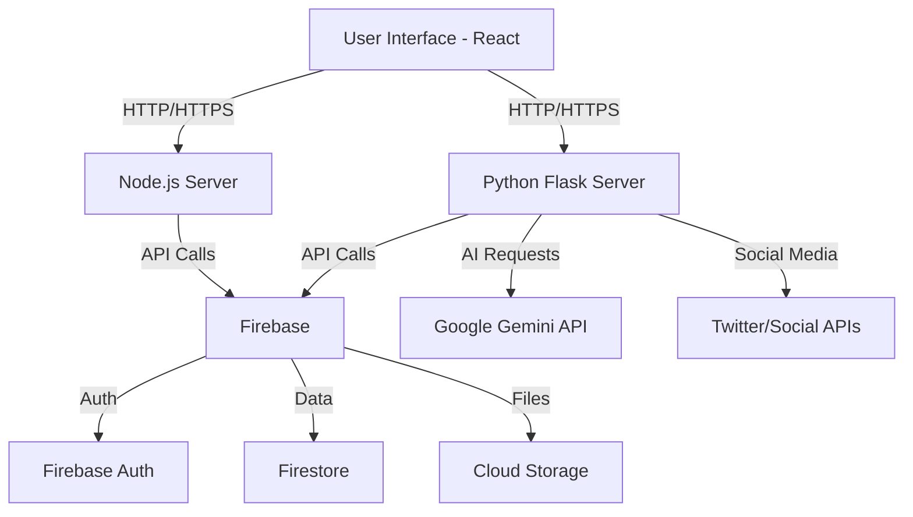

# 🚀 Social Sphere - AI-Powered Social Media Management Platform

<div align="center">


**A full-stack social media management platform with AI-powered content generation, automation, and analytics.**

[Features](#-features) • [Tech Stack](#-tech-stack) • [Installation](#-installation) • [Usage](#-usage) • [API Documentation](#-api-documentation) • [Contributing](#-contributing)

</div>

---

## 📋 Table of Contents

- [Overview](#-overview)
- [Features](#-features)
- [Tech Stack](#-tech-stack)
- [Architecture](#-architecture)
- [Installation](#-installation)
- [Configuration](#-configuration)
- [Usage](#-usage)
- [API Documentation](#-api-documentation)
- [Frontend Structure](#-frontend-structure)
- [Backend Structure](#-backend-structure)
- [AI Components](#-ai-components)
- [Database Schema](#-database-schema)
- [Security](#-security)
- [Contributing](#-contributing)
- [License](#-license)

---

## 🌟 Overview

**Social Sphere** is a comprehensive social media management platform that leverages artificial intelligence to streamline content creation, scheduling, and analytics. Built with a modern tech stack, it provides users with powerful tools to manage multiple social media accounts, generate AI-powered content, and gain insights through advanced analytics.

### Key Highlights

- 🤖 **AI-Powered Content Generation** - Automatically generate engaging posts using advanced AI models
- 📅 **Smart Scheduling** - Schedule posts across multiple platforms with intelligent timing suggestions
- 📊 **Real-time Analytics** - Track engagement, reach, and performance metrics
- 🔄 **Multi-Platform Support** - Manage Twitter, Facebook, Instagram, and LinkedIn from one dashboard
- 💬 **AI Chatbot Integration** - Interactive assistant for content suggestions and platform guidance
- 🔐 **Secure Authentication** - Firebase-based authentication with role-based access control

---

## ✨ Features

### Core Features

- **AI Content Generator**
  - Generate posts based on topics, tone, and target audience
  - Multiple AI models support (GPT, Gemini)
  - Hashtag suggestions and optimization
  - Image generation capabilities

- **Post Management**
  - Create, edit, and delete posts
  - Draft saving functionality
  - Multi-platform posting
  - Media upload and management

- **Scheduling & Automation**
  - Advanced scheduling engine
  - Timezone-aware posting
  - Recurring posts support
  - Best time to post recommendations

- **Analytics Dashboard**
  - Real-time engagement metrics
  - Performance tracking
  - Audience insights
  - Export reports functionality

- **Social Media Fetcher**
  - Fetch posts from connected accounts
  - Engagement data synchronization
  - Trend analysis

- **AI Chatbot**
  - Interactive content assistance
  - Platform-specific tips
  - Query resolution

---

## 🛠 Tech Stack

### Frontend

| Technology | Version | Purpose |
|------------|---------|---------|
| **React** | 18.x | UI Framework |
| **Vite** | Latest | Build tool and dev server |
| **TailwindCSS** | 3.x | Utility-first CSS framework |
| **React Router** | 6.x | Client-side routing |
| **Axios** | Latest | HTTP client |
| **Lucide React** | Latest | Icon library |
| **React Hot Toast** | Latest | Notifications |
| **Date-fns** | Latest | Date manipulation |

### Backend

#### Node.js Server
| Technology | Version | Purpose |
|------------|---------|---------|
| **Express.js** | 4.x | Web framework |
| **CORS** | Latest | Cross-origin resource sharing |
| **Dotenv** | Latest | Environment configuration |

#### Python Server
| Technology | Version | Purpose |
|------------|---------|---------|
| **Flask** | 2.x | Microframework |
| **Flask-CORS** | Latest | CORS handling |
| **Google Generative AI** | Latest | AI content generation |
| **Firebase Admin** | Latest | Firebase integration |
| **Tweepy** | Latest | Twitter API integration |
| **Requests** | Latest | HTTP library |

### Cloud & Services

- **Firebase**
  - Authentication
  - Firestore Database
  - Cloud Storage
  - Hosting

- **AI Services**
  - Google Gemini API
  - OpenAI API (optional)

---

## 🏗 Architecture

```
Social-Shepre-full/
│
├── frontend (social-media/)
│   ├── src/
│   │   ├── components/     # React components
│   │   ├── pages/          # Page components
│   │   ├── hooks/          # Custom React hooks
│   │   ├── utils/          # Utility functions
│   │   ├── services/       # API services
│   │   └── styles/         # CSS/Tailwind styles
│   │
│   └── public/             # Static assets
│
└── backend/
    ├── server.js           # Node.js Express server
    ├── server.py           # Flask Python server
    ├── ai_post_generator.py    # AI content generation
    ├── ai_automation.py        # Automation logic
    ├── chatbot_api.py         # Chatbot functionality
    ├── fetcher.py             # Social media fetching
    ├── firebase_storage.py    # Firebase operations
    └── app.py                 # Additional Flask app
```

### System Flow



---

## 🚀 Installation

### Prerequisites

- **Node.js** (v16.x or higher)
- **Python** (v3.8 or higher)
- **npm** or **yarn**
- **pip** (Python package manager)
- Firebase account with project setup
- Google AI API key (Gemini)

### Step 1: Clone the Repository

```bash
git clone https://github.com/HarshXAI/Social-Shepre-full.git
cd Social-Shepre-full
```

### Step 2: Backend Setup

#### Python Backend

```bash
cd backend

# Create virtual environment (recommended)
python -m venv venv
source venv/bin/activate  # On Windows: venv\Scripts\activate

# Install Python dependencies
pip install -r req.txt
```

#### Node.js Backend

```bash
# In backend directory
npm install
```

### Step 3: Frontend Setup

```bash
cd ../social-media
npm install
```

### Step 4: Environment Configuration

#### Backend Environment Variables

Create a `.env` file in the `backend/` directory:

```env
# Firebase Configuration
FIREBASE_API_KEY=your_firebase_api_key
FIREBASE_AUTH_DOMAIN=your_project.firebaseapp.com
FIREBASE_PROJECT_ID=your_project_id
FIREBASE_STORAGE_BUCKET=your_project.appspot.com
FIREBASE_MESSAGING_SENDER_ID=your_sender_id
FIREBASE_APP_ID=your_app_id

# Google AI
GOOGLE_API_KEY=your_gemini_api_key

# Twitter API (if using)
TWITTER_API_KEY=your_twitter_api_key
TWITTER_API_SECRET=your_twitter_api_secret
TWITTER_ACCESS_TOKEN=your_access_token
TWITTER_ACCESS_SECRET=your_access_secret

# Server Configuration
PORT=5000
FLASK_PORT=5001
NODE_ENV=development
```

Refer to `backend/.env.example` for a complete list of required variables.

#### Frontend Environment Variables

Create a `.env` file in the `social-media/` directory:

```env
VITE_API_URL=http://localhost:5000
VITE_PYTHON_API_URL=http://localhost:5001
VITE_FIREBASE_API_KEY=your_firebase_api_key
VITE_FIREBASE_AUTH_DOMAIN=your_project.firebaseapp.com
VITE_FIREBASE_PROJECT_ID=your_project_id
```

---

## ⚙️ Configuration

### Firebase Setup

1. Create a Firebase project at [Firebase Console](https://console.firebase.google.com/)
2. Enable Authentication (Email/Password, Google)
3. Create a Firestore database
4. Enable Cloud Storage
5. Download service account key and place in `backend/`
6. Update Firebase configuration in `.env`

### Google AI (Gemini) Setup

1. Get API key from [Google AI Studio](https://makersuite.google.com/)
2. Add to `GOOGLE_API_KEY` in backend `.env`

### Social Media API Setup

- **Twitter**: Create app at [Twitter Developer Portal](https://developer.twitter.com/)
- **Facebook**: Setup at [Facebook Developers](https://developers.facebook.com/)
- Add credentials to `.env`

---

## 💻 Usage

### Development Mode

#### Start Backend Servers

**Terminal 1 - Python Flask Server:**
```bash
cd backend
python server.py
# Server runs on http://localhost:5001
```

**Terminal 2 - Node.js Express Server:**
```bash
cd backend
node server.js
# Server runs on http://localhost:5000
```

#### Start Frontend

**Terminal 3 - React Dev Server:**
```bash
cd social-media
npm run dev
# App runs on http://localhost:5173
```

### Production Build

#### Frontend Build
```bash
cd social-media
npm run build
npm run preview  # Preview production build
```

#### Backend Production
```bash
# Use process managers like PM2
pm2 start backend/server.js
pm2 start backend/server.py --interpreter python3
```

---

## 📚 API Documentation

### Node.js Server Endpoints (Port 5000)

#### Authentication
- `POST /api/auth/register` - Register new user
- `POST /api/auth/login` - User login
- `POST /api/auth/logout` - User logout
- `GET /api/auth/verify` - Verify token

#### Posts
- `GET /api/posts` - Get all posts
- `GET /api/posts/:id` - Get single post
- `POST /api/posts` - Create new post
- `PUT /api/posts/:id` - Update post
- `DELETE /api/posts/:id` - Delete post

#### Media
- `POST /api/upload` - Upload media files
- `GET /api/media/:id` - Get media file

### Python Flask Server Endpoints (Port 5001)

#### AI Content Generation
```http
POST /api/generate-post
Content-Type: application/json

{
  "topic": "Technology trends",
  "tone": "professional",
  "platform": "twitter",
  "length": "short"
}
```

**Response:**
```json
{
  "success": true,
  "content": "Generated post content...",
  "hashtags": ["#Tech", "#AI"],
  "suggestions": []
}
```

#### Chatbot
```http
POST /api/chatbot
Content-Type: application/json

{
  "message": "How do I schedule a post?",
  "context": "scheduling"
}
```

#### Social Media Fetcher
```http
GET /api/fetch-posts?platform=twitter&count=10
```

#### Automation
```http
POST /api/automation/schedule
Content-Type: application/json

{
  "postId": "123",
  "scheduledTime": "2025-10-26T10:00:00Z",
  "platforms": ["twitter", "facebook"]
}
```

---

## 🎨 Frontend Structure

### Component Architecture

```
src/
├── components/
│   ├── Auth/
│   │   ├── Login.jsx
│   │   ├── Register.jsx
│   │   └── ProtectedRoute.jsx
│   │
│   ├── Dashboard/
│   │   ├── DashboardLayout.jsx
│   │   ├── Stats.jsx
│   │   └── QuickActions.jsx
│   │
│   ├── Post/
│   │   ├── PostEditor.jsx
│   │   ├── PostCard.jsx
│   │   ├── PostList.jsx
│   │   └── MediaUploader.jsx
│   │
│   ├── AI/
│   │   ├── ContentGenerator.jsx
│   │   ├── Chatbot.jsx
│   │   └── Suggestions.jsx
│   │
│   ├── Analytics/
│   │   ├── AnalyticsDashboard.jsx
│   │   ├── Charts.jsx
│   │   └── Reports.jsx
│   │
│   └── Common/
│       ├── Navbar.jsx
│       ├── Sidebar.jsx
│       ├── Modal.jsx
│       └── Loader.jsx
│
├── pages/
│   ├── Home.jsx
│   ├── Dashboard.jsx
│   ├── Posts.jsx
│   ├── Schedule.jsx
│   ├── Analytics.jsx
│   └── Settings.jsx
│
├── services/
│   ├── api.js              # API client
│   ├── auth.js             # Auth service
│   └── firebase.js         # Firebase config
│
└── utils/
    ├── helpers.js          # Helper functions
    ├── constants.js        # Constants
    └── validators.js       # Form validators
```

### Key Technologies

- **State Management**: React Context API / useState hooks
- **Routing**: React Router v6 with protected routes
- **Styling**: TailwindCSS with custom components
- **Forms**: Controlled components with validation
- **API Calls**: Axios with interceptors

---

## 🐍 Backend Structure

### Python Modules

#### `ai_post_generator.py`
AI-powered content generation using Google Gemini API.

```python
Key Functions:
- generate_post(topic, tone, platform)
- generate_hashtags(content)
- optimize_content(text, platform)
- generate_image_prompt(content)
```

#### `ai_automation.py`
Handles scheduling and automation logic.

```python
Key Functions:
- schedule_post(post_data, time)
- auto_publish(post_id)
- best_time_to_post(platform, audience)
- recurring_posts_handler()
```

#### `chatbot_api.py`
AI chatbot for user assistance.

```python
Key Functions:
- process_query(message, context)
- get_suggestions(topic)
- help_commands()
```

#### `fetcher.py`
Fetches data from social media platforms.

```python
Key Functions:
- fetch_twitter_posts(user_id)
- fetch_engagement_data(post_id)
- sync_platforms()
```

#### `firebase_storage.py`
Firebase operations handler.

```python
Key Functions:
- upload_file(file, path)
- download_file(path)
- delete_file(path)
- get_file_url(path)
```

### Node.js Modules

#### `server.js`
Main Express server handling REST API endpoints.

```javascript
Features:
- Express middleware configuration
- Route handling
- Error management
- CORS configuration
- Request logging
```

---

## 🗄 Database Schema

### Firestore Collections

#### `users`
```javascript
{
  uid: string,
  email: string,
  displayName: string,
  photoURL: string,
  createdAt: timestamp,
  role: string,
  connectedAccounts: {
    twitter: { connected: boolean, username: string },
    facebook: { connected: boolean, pageId: string }
  }
}
```

#### `posts`
```javascript
{
  id: string,
  userId: string,
  content: string,
  media: [string],
  platforms: [string],
  status: 'draft' | 'scheduled' | 'published',
  scheduledTime: timestamp,
  publishedTime: timestamp,
  aiGenerated: boolean,
  engagement: {
    likes: number,
    comments: number,
    shares: number
  },
  createdAt: timestamp,
  updatedAt: timestamp
}
```

#### `analytics`
```javascript
{
  postId: string,
  platform: string,
  impressions: number,
  reach: number,
  engagement: number,
  clicks: number,
  date: timestamp
}
```

#### `schedules`
```javascript
{
  postId: string,
  scheduledTime: timestamp,
  platforms: [string],
  status: 'pending' | 'completed' | 'failed',
  recurring: boolean,
  frequency: string
}
```

---

## 🔐 Security

### Best Practices Implemented

- **Authentication**: Firebase Authentication with JWT tokens
- **Authorization**: Role-based access control (RBAC)
- **Data Validation**: Input sanitization on both client and server
- **CORS**: Configured for specific origins
- **Environment Variables**: Sensitive data stored in .env files
- **Rate Limiting**: API rate limiting to prevent abuse
- **HTTPS**: Enforced in production
- **SQL Injection Prevention**: Using parameterized queries
- **XSS Protection**: Content sanitization

### Security Configuration

```javascript
// CORS Configuration
const corsOptions = {
  origin: process.env.FRONTEND_URL,
  credentials: true,
  optionsSuccessStatus: 200
};

// Rate Limiting
const limiter = rateLimit({
  windowMs: 15 * 60 * 1000, // 15 minutes
  max: 100 // limit each IP to 100 requests per windowMs
});
```

For detailed security guidelines, see [SECURITY.md](./SECURITY.md)

---

## 🧪 Testing

### Running Tests

```bash
# Frontend tests
cd social-media
npm run test

# Backend tests
cd backend
python -m pytest
npm test
```

### Test Coverage

- Unit tests for components
- Integration tests for API endpoints
- E2E tests for critical user flows

---

## 🚀 Deployment

### Frontend Deployment (Vercel/Netlify)

```bash
cd social-media
npm run build
# Deploy dist/ folder
```

### Backend Deployment

#### Using Docker
```dockerfile
# Dockerfile example
FROM node:16
WORKDIR /app
COPY package*.json ./
RUN npm install
COPY . .
EXPOSE 5000
CMD ["node", "server.js"]
```

#### Using Cloud Services
- **Firebase Functions**: For serverless deployment
- **Heroku**: For quick deployment
- **AWS EC2**: For full control
- **Google Cloud Run**: For containerized apps

---

## 🤝 Contributing

We welcome contributions! Please follow these steps:

1. **Fork the repository**
2. **Create a feature branch**
   ```bash
   git checkout -b feature/AmazingFeature
   ```
3. **Commit your changes**
   ```bash
   git commit -m 'Add some AmazingFeature'
   ```
4. **Push to the branch**
   ```bash
   git push origin feature/AmazingFeature
   ```
5. **Open a Pull Request**

### Development Guidelines

- Follow ESLint and Prettier configurations
- Write meaningful commit messages
- Add tests for new features
- Update documentation
- Follow the code style guide

---

## 📝 License

This project is licensed under the MIT License - see the [LICENSE](LICENSE) file for details.

---

## 👨‍💻 Author

**HarshXAI**

- GitHub: [@HarshXAI](https://github.com/HarshXAI)
- Repository: [Social-Shepre-full](https://github.com/HarshXAI/Social-Shepre-full)

---

## 🙏 Acknowledgments

- Google Gemini AI for content generation
- Firebase for backend infrastructure
- React community for excellent tools
- All contributors and supporters

---

## 📞 Support

For support, email [your-email] or create an issue in the repository.

---

## 🗺 Roadmap

- [ ] Instagram direct posting integration
- [ ] Advanced analytics with ML insights
- [ ] Team collaboration features
- [ ] Mobile app (React Native)
- [ ] White-label solution
- [ ] Multi-language support
- [ ] Video content support
- [ ] Influencer marketplace

---

<div align="center">

**Made with ❤️ by HarshXAI**

⭐ Star this repo if you find it helpful!

</div>
